# kumiko-generator



麻の葉模様などの日本の伝統的な組子（くみこ）文様を SVG で生成するツールです。

## 概要

kumiko-generator は、パターン定義ファイルから SVG 形式の組子文様を生成するコマンドラインツールです。複雑な幾何学模様を簡単に作成し、カスタマイズできます。

### 特徴

- **複数のパターン対応**: 麻の葉（Asanoha）、胡麻（Goma）、角麻（Kaku-Asanoha）
- **柔軟な設定**: JSON 形式でパターンを定義・カスタマイズ
- **色指定対応**: スケルトン・リーフの色を個別に指定可能
- **繰り返し機能**: パターンを水平・垂直方向に繰り返す
- **複数フォーマット対応**: テキスト、JSON、CSV 形式の入力ファイルに対応

## インストール

```bash
# 依存関係をインストール
pnpm install
```

## 使い方

### 基本的な使用方法

```bash
pnpm dev -i <入力ファイル> -o <出力ファイル>
```

### オプション

#### 必須オプション

- `-i, --input <path>`: 入力ファイル（.txt, .csv, .json）- **必須**

#### 出力オプション

- `-o, --output <path>`: 出力 SVG ファイルパス
  - 指定しない場合、入力ファイルの拡張子を `.svg` に変更したパスを使用

#### パターン設定

- `--pattern-config <path>`: パターン設定ファイル（JSON 形式）
  - 文字とパターンの対応関係、色などを定義

#### サイズ・繰り返し

- `--side-length <number>`: 単位三角形の辺の長さ（デフォルト: 100）
- `--repeat-x <number>`: 水平方向の繰り返し数（デフォルト: 1）
- `--repeat-y <number>`: 垂直方向の繰り返し数（デフォルト: 1）

#### 色設定

- `--skeleton-color <hex>`: スケルトン（骨組み）の色（デフォルト: #8d6e63）
- `--leaf-color <hex>`: リーフ（葉）の色（デフォルト: #8d6e63）
- `--background-color <hex>`: 背景色（デフォルト: #33312eff）

#### 線の太さ設定

- `--skeleton-thickness <number>`: スケルトンの線の太さ（デフォルト: side-length × 0.04）
- `--leaf-thickness <number>`: リーフの線の太さ（デフォルト: side-length × 0.015）

### 入力ファイル形式

#### プレーンテキスト形式 (.txt)

```
# コメント行（# で始まる行は無視される）
K | k | k | K
A A | G G | A A
A | A | A | A
```

- `|` で区切られた部分が「セグメント」（壁）
- スペースで区切られた文字がパターン

#### JSON 形式 (.json)

**形式 1: 直接配列**

```json
["K | k | k | K", "A A | G G | A A", "A | A | A | A"]
```

**形式 2: grid プロパティ**

```json
{
  "grid": ["K | k | k | K", "A A | G G | A A", "A | A | A | A"]
}
```

#### CSV 形式 (.csv)

```
K,k,k,K
A A,G G,A A
A,A,A,A
```

各セルがセグメントに変換されます。

### パターン設定ファイル形式

パターン設定ファイルは JSON 形式で、文字とパターンタイプのマッピングを定義します。

```json
{
  "characters": {
    "A": {
      "type": "asanoha",
      "options": {
        "skeletonColor": "#8d6e63",
        "leafColor": "#8d6e63"
      }
    },
    "K": {
      "type": "kaku",
      "options": {
        "ratio": 0.65,
        "skeletonColor": "#ff0000"
      }
    },
    "k": {
      "type": "kaku",
      "options": {
        "ratio": 0.8
      }
    },
    "G": {
      "type": "goma",
      "options": {
        "showCenterLine": false,
        "leafColor": "#00ff00"
      }
    }
  }
}
```

#### パターンタイプ

##### asanoha（麻の葉）

```json
{
  "type": "asanoha",
  "options": {
    "skeletonColor": "#色コード",
    "leafColor": "#色コード",
    "skeletonThickness": 4,
    "leafThickness": 2
  }
}
```

##### goma（胡麻）

```json
{
  "type": "goma",
  "options": {
    "showCenterLine": true|false,
    "skeletonColor": "#色コード",
    "leafColor": "#色コード",
    "skeletonThickness": 4,
    "leafThickness": 2
  }
}
```

##### kaku（角麻）

```json
{
  "type": "kaku",
  "options": {
    "ratio": 0.0~1.0,
    "skeletonColor": "#色コード",
    "leafColor": "#色コード",
    "skeletonThickness": 4,
    "leafThickness": 2
  }
}
```

- `ratio`: 内枠の縮小率（デフォルト: 0.65）
- `skeletonThickness`: スケルトンの線の太さ（オプション）
- `leafThickness`: リーフの線の太さ（オプション）

## 使用例

### 例 1: シンプルな使用方法

```bash
pnpm dev -i sample/pattern.txt -o output.svg
```

### 例 2: パターンを繰り返す

```bash
pnpm dev -i sample/pattern.txt -o tiled.svg --repeat-x 3 --repeat-y 2
```

### 例 3: カスタムパターン設定を使用

```bash
pnpm dev -i sample/pattern.txt -o custom.svg --pattern-config sample/pattern-config.example.json
```

### 例 4: サイズと色を指定

```bash
pnpm dev \
  -i sample/pattern.txt \
  -o large.svg \
  --side-length 150 \
  --skeleton-color "#ff0000" \
  --leaf-color "#00ff00" \
  --background-color "#000000"
```

### 例 5: 線の太さをカスタマイズ

```bash
pnpm dev \
  -i sample/pattern.txt \
  -o thick-lines.svg \
  --skeleton-thickness 6 \
  --leaf-thickness 3
```

### 例 6: すべてのオプションを組み合わせ

```bash
pnpm dev \
  -i sample/pattern.txt \
  -o final.svg \
  --pattern-config sample/pattern-config.example.json \
  --repeat-x 4 \
  --repeat-y 3 \
  --side-length 120 \
  --background-color "#fafafa" \
  --skeleton-thickness 5 \
  --leaf-thickness 2.5
```

## コマンドリファレンス

### 開発モード

```bash
# ソースコードを監視して実行
pnpm dev -- --help

# 入力ファイル必須
pnpm dev -- -i pattern.txt
```

### ビルド

```bash
# TypeScript をビルド
pnpm build
```

## ファイル構造

```
kumiko-generator/
├── src/
│   ├── index.ts              # CLIエントリーポイント
│   ├── generator.ts          # SVG生成ロジック
│   ├── parser.ts             # 入力ファイル解析
│   ├── pattern-config.ts     # パターン設定管理
│   ├── renderer/             # パターンレンダラー
│   │   ├── asanoha.ts
│   │   ├── goma.ts
│   │   ├── kaku.ts
│   │   └── index.ts
│   ├── types/                # 型定義
│   │   ├── config.ts
│   │   ├── pattern.ts
│   │   └── index.ts
│   └── utils/                # ユーティリティ
│       ├── geom.ts
│       └── index.ts
├── bin/
│   └── kumiko.mjs            # 実行可能スクリプト
├── sample/                   # サンプルファイル
│   ├── pattern-config.example.json
│   └── pattern.txt
├── package.json
├── tsconfig.json
└── README.md
```

## パターン記号

デフォルト設定で使用できる記号：

| 記号 | パターン名         | 説明                   |
| ---- | ------------------ | ---------------------- |
| `A`  | Asanoha            | 麻の葉                 |
| `K`  | Kaku (ratio: 0.65) | 角麻（標準）           |
| `k`  | Kaku (ratio: 0.8)  | 角麻（バリエーション） |
| `G`  | Goma               | 胡麻（枠のみ）         |
| `.`  | Goma               | 胡麻（枠のみ）         |

カスタム記号はパターン設定ファイルで定義できます。

## トラブルシューティング

### "Missing required argument: input"

入力ファイルが指定されていません。`-i` オプションで入力ファイルを指定してください。

```bash
pnpm dev -i pattern.txt
```

### "Input file not found"

指定したファイルが見つかりません。ファイルパスと拡張子を確認してください。

### "Unsupported file format"

サポートされていないファイル形式です。`.txt`, `.csv`, `.json` のいずれかを使用してください。

### "Invalid JSON format"

JSON ファイルのフォーマットが正しくありません。JSON の構文を確認してください。

## ライセンス

MIT

## 技術スタック

- **TypeScript**: 言語
- **Yargs**: CLI フレームワーク
- **Node.js**: ランタイム
- **tsdown**: TypeScript コンパイラ
